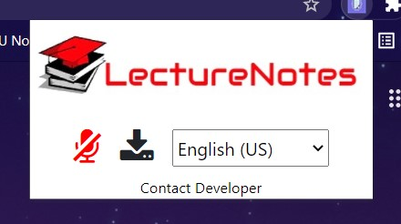
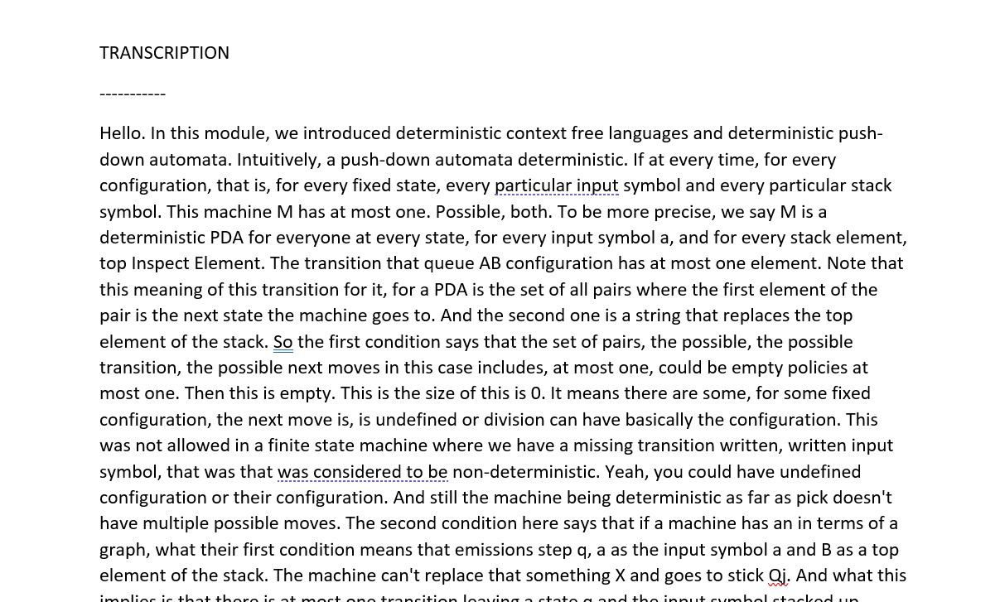
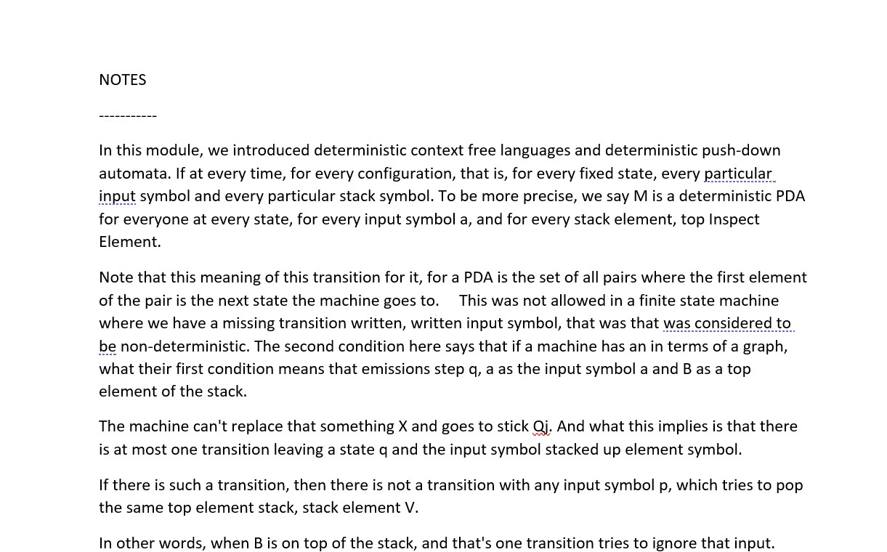

<link href="https://fonts.googleapis.com/css2?family=Audiowide&display=swap" rel="stylesheet">

<h1>
<span style="color:red; font-family:Audiowide; font-size:48px; font-weight: normal" >LectureNotes</span>
</h1>

A chrome extension that summarizes audio from a chrome tab into text with support for multiple languages 

This application was developed after my friends complained how difficult it is to take understand and take notes from a lecture at the same time and is primarily intended to take notes during a live session/lecture.


## Screenshots

<p width="100%">
  
</p>

<p float="left">
  
  
</p>

## Working

* Upon intialization
  * The client registered itself with the server - uses short polling incase of a server error
  * Audio configration is sent to the server
  * The server creates a session corresponding to the client 
<br/>
* Upon start recording
  * A WebSocket connection is opened with the server
  * The audio stream of the tab is captured by the background script - before it reaches to the speaker.   
  * A Audio object plays the audio from the background script
  * Every 14 secs, a base64 string of the audio is sent to the server for transcription via Google speech to text.
<br/>
* Upon stop recording
  * The last buffered audio is sent to the server as a base64 string
  * Websocket connection is terminated
  * All audio streams are disconnected
  * Other objects are destroyed
<br/>
* Upon get notes
  * Server performs text summerization using DeepAI, sends back the response and resets transcription
  * Client converts the response into a blob and downloads it.


## Optimizations

* Increased performance by ~70ms by implementing a dual communication channel of http requests and web sockets.
  * Intially, a single Websocket connection was used for server-client communication and different event data were transmitted as JSON.
  * The audio is encoded uses PCM .wav format, A 14 sec base64 audio string is of size ~1.5Mb
  * To avoid json processing of a 1.5 Mb string, websockets now transmit the raw base64 audio string whereas http request are used for other type of events.

## Future Planning

* Use redis for storing session data
* Implement a heartbeat mechanism for websockets to identify and terminate broken connections
* Capture a tab close event to stop recording.
* Make CORS opaque.
* Use a compressed audio format like .mp3.
* Add unit tests.

## API Reference

#### Register a client

```http
  POST /register
  Return: <text/plain> unique ID, used for further communication. 

```
| Parameter | Type     | Description                |
| :-------- | :------- | :------------------------- |
| config | json |  [Configration](https://cloud.google.com/speech-to-text/docs/reference/rest/v1/RecognitionConfig) of google speech to text api |

#### Get notes

```http
  POST /getNotes
  Return: <text/plain> Summarized text and transcription 
```

| Parameter | Type     | Description                       |
| :-------- | :------- | :-------------------------------- |
| ID      | Integer | **Required**. ID returned from /register api |

#### Send audio

```WS
  Websocket ws://${HOST}?ID=${clientID}&languageCode=${languageCode}
  Example: ws://LectureNotes:8080?ID=12&languageCode=hi-IN
  Note: Use native websockets
  
  Return: <text/plain> errors, if any
```

| QueryString Parameter | Type     | Description                       |
| :-------- | :------- | :-------------------------------- |
| ID      | Integer | **Required**. ID returned from /register api |


| QueryString Parameter | Type     | Description                       |
| :-------- | :------- | :-------------------------------- |
| language      | String | Language code; Defaults to en-US

| Websocket message | Type     | Description                       |
| :-------- | :------- | :-------------------------------- |
| | base64 string | base64 encoded string of audio; must not exceed 10MB/15 secs

  
## Run Locally

Install node and npm
```
https://nodejs.org/en/download/
```

Clone the project

```
  git clone https://github.com/smitdesai1010/LectureNotes.git
```

To run this project, you will need to add the following environment variables in a ./Server/.env file

<pre>
  <a href="https://deepai.org/api-docs/
  ">DEEPAI_KEY</a>

  <a href="https://cloud.google.com/speech-to-text/docs/before-you-begin 
  ">GOOGLE_APPLICATION_CREDENTIALS</a>
</pre>

Go to the project directory
  
``` 
   cd Server
   npm install      //Install dependencies
   npm start        //starts server 
```

To start client (chrome-extension)
```
    Open Google chrome
    Click on "extension" > "Manage extensions"
    Click on "Load unpacked" and select the ./client/ folder in the project directory
    Click on extensions and allow "LectureNotes"
```


  
## Acknowledgements

 - [Chrome extension API](https://developer.chrome.com/docs/extensions/reference/)
 - [Google speech to text](https://cloud.google.com/speech-to-text/?utm_source=google&utm_medium=cpc&utm_campaign=japac-IN-all-en-dr-bkws-all-super-trial-e-dr-1009882&utm_content=text-ad-none-none-DEV_c-CRE_506995057599-ADGP_Hybrid%20%7C%20BKWS%20-%20EXA%20%7C%20Txt%20~%20AI%20%26%20ML%20~%20Speech-to-Text_Speech%20-%20google%20speech%20to%20text-KWID_43700030970546716-kwd-21425535976&userloc_9301226-network_g&utm_term=KW_google%20speech%20to%20text&gclsrc=aw.ds&ds_rl=1264446&gclid=Cj0KCQjwpreJBhDvARIsAF1_BU1UJI_d8euTVe-u9n9vbAiTGWjDwau8Y9x7bmrNI-mxsxFPVEAfMmEaArEbEALw_wcB)
 - [DeepAI text summarizer API](https://deepai.org/machine-learning-model/summarization)
 - [Websockets for node.js](https://www.npmjs.com/package/ws)

  
## Feedback

If you have any feedback, please reach out to me at smitdesai1010@gmail.com
  
